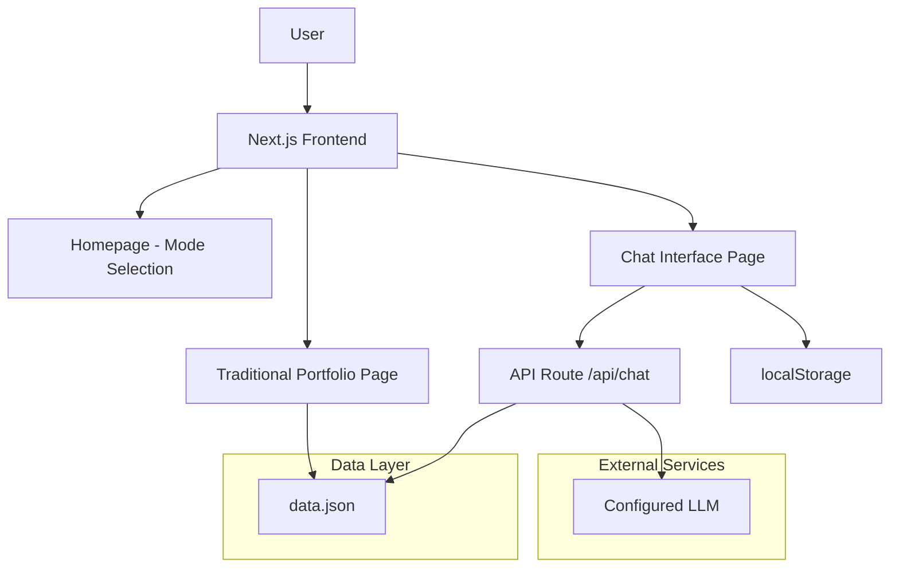

# Design Document

## Overview

The AI Portfolio Chatbot is a Next.js application that provides a dual-interface portfolio experience. The system architecture prioritizes simplicity, performance, and maintainability by using a single data source, server-side rendering for SEO, and client-side interactivity for the chat experience.

### Key Design Principles
- **Single Source of Truth**: All portfolio data comes from `data.json`
- **Zero Backend Complexity**: Leverages Next.js API routes for minimal server logic
- **Progressive Enhancement**: Traditional portfolio works without JavaScript, chat requires it
- **Responsive Design**: Mobile-first approach with seamless desktop scaling
- **Accessibility First**: WCAG 2.1 AA compliance throughout

## Architecture

### High-Level Architecture



### Technology Stack
- **Framework**: Next.js 14+ with App Router
- **Styling**: Tailwind CSS for utility-first styling
- **State Management**: React hooks + localStorage for chat persistence
- **LLM Integration**: Configurable through environment variables
- **Deployment**: Static export compatible for easy hosting

## Components and Interfaces

### Core Components

#### 1. Homepage Component (`/`)
- **Purpose**: Mode selection landing page
- **Props**: None (uses data.json for basic info)
- **Features**:
  - Hero section with professional's name and tagline
  - Two prominent CTA buttons for mode selection
  - Brief descriptions of each mode
  - Responsive design with smooth animations

#### 2. Traditional Portfolio Component (`/portfolio`)
- **Purpose**: Server-side rendered portfolio display
- **Props**: Portfolio data from data.json
- **Features**:
  - Professional header with photo and contact info
  - Sectioned layout: Experience, Projects, Skills, Education, Achievements
  - Smooth scroll navigation
  - Download CV functionality
  - SEO optimized with meta tags

#### 3. Chat Interface Component (`/chat`)
- **Purpose**: AI-powered conversational interface
- **Props**: None (loads data client-side)
- **Features**:
  - WhatsApp-like chat UI
  - Message streaming with typing indicators
  - Conversation persistence via localStorage
  - Suggested starter questions
  - Error handling for API failures

#### 4. Shared Components

##### ChatMessage Component
```typescript
interface ChatMessageProps {
  message: string;
  isUser: boolean;
  timestamp: Date;
  isStreaming?: boolean;
}
```

##### PortfolioSection Component
```typescript
interface PortfolioSectionProps {
  title: string;
  content: any;
  sectionId: string;
}
```

##### NavigationMenu Component
```typescript
interface NavigationMenuProps {
  currentPage: 'home' | 'portfolio' | 'chat';
  portfolioData: PortfolioData;
}
```

### API Interfaces

#### Chat API Route (`/api/chat`)
```typescript
// Request
interface ChatRequest {
  message: string;
  conversationHistory: ChatMessage[];
}

// Response (Streaming)
interface ChatResponse {
  content: string;
  done: boolean;
  error?: string;
}
```

#### Data Loading Interface
```typescript
interface PortfolioData {
  personal: {
    name: string;
    title: string;
    email: string;
    phone: string;
    location: string;
    summary: string;
    photo: string;
  };
  experience: ExperienceItem[];
  projects: ProjectItem[];
  skills: SkillCategory[];
  education: EducationItem[];
  achievements: string[];
  social: SocialLink[];
}
```

## Data Models

### Primary Data Structure (data.json)

```json
{
  "personal": {
    "name": "Professional Name",
    "title": "Job Title",
    "email": "email@example.com",
    "phone": "+1234567890",
    "location": "City, Country",
    "summary": "Professional summary...",
    "photo": "/images/profile.jpg"
  },
  "experience": [
    {
      "company": "Company Name",
      "position": "Job Title",
      "duration": "Start - End",
      "description": "Job description...",
      "technologies": ["Tech1", "Tech2"]
    }
  ],
  "projects": [
    {
      "name": "Project Name",
      "description": "Project description...",
      "technologies": ["Tech1", "Tech2"],
      "link": "https://project-url.com",
      "github": "https://github.com/user/repo"
    }
  ],
  "skills": [
    {
      "category": "Programming Languages",
      "items": ["JavaScript", "Python", "TypeScript"]
    }
  ],
  "education": [
    {
      "institution": "University Name",
      "degree": "Degree Type",
      "field": "Field of Study",
      "duration": "Start - End",
      "gpa": "3.8/4.0"
    }
  ],
  "achievements": [
    "Achievement description..."
  ],
  "social": [
    {
      "platform": "LinkedIn",
      "url": "https://linkedin.com/in/username"
    }
  ]
}
```

### Chat Context Formatting

The system transforms `data.json` into LLM-friendly context:

```typescript
function formatPortfolioForLLM(data: PortfolioData): string {
  return `
You are an AI assistant representing ${data.personal.name}, a ${data.personal.title}.

PERSONAL INFO:
- Name: ${data.personal.name}
- Title: ${data.personal.title}
- Location: ${data.personal.location}
- Summary: ${data.personal.summary}

EXPERIENCE:
${data.experience.map(exp => `
- ${exp.position} at ${exp.company} (${exp.duration})
  ${exp.description}
  Technologies: ${exp.technologies.join(', ')}
`).join('')}

[Additional sections formatted similarly...]

Please answer questions about this professional's background, experience, and skills based on this information.
`;
}
```

## Error Handling

### Client-Side Error Handling

#### Chat Interface Errors
- **Network Failures**: Display retry button with exponential backoff
- **API Errors**: Show user-friendly error messages
- **Streaming Interruptions**: Allow message regeneration
- **localStorage Issues**: Graceful degradation without persistence

#### Portfolio Page Errors
- **Data Loading Failures**: Show error boundary with reload option
- **Image Loading Failures**: Fallback to placeholder images
- **Navigation Issues**: Ensure basic functionality remains

### Server-Side Error Handling

#### API Route Error Responses
```typescript
// Error response format
interface ErrorResponse {
  error: string;
  code: 'MISSING_ENV' | 'LLM_ERROR' | 'INVALID_REQUEST';
  message: string;
}
```

#### Environment Variable Validation
```typescript
function validateEnvironment(): void {
  const required = ['LLM_API_KEY', 'LLM_MODEL', 'LLM_BASE_URL'];
  const missing = required.filter(key => !process.env[key]);
  
  if (missing.length > 0) {
    throw new Error(`Missing environment variables: ${missing.join(', ')}`);
  }
}
```

## Testing Strategy

### Unit Testing
- **Data Loading Functions**: Test JSON parsing and validation
- **Utility Functions**: Test data formatting and transformation
- **Component Logic**: Test state management and user interactions

### Integration Testing
- **API Routes**: Test chat endpoint with mock LLM responses
- **Page Rendering**: Test SSR with various data configurations
- **Client-Side Navigation**: Test routing between modes

### End-to-End Testing
- **User Flows**: Test complete user journeys through both interfaces
- **Responsive Design**: Test across different screen sizes
- **Accessibility**: Test keyboard navigation and screen reader compatibility

### Performance Testing
- **Load Times**: Ensure pages load within 2-second requirement
- **Bundle Size**: Monitor JavaScript bundle size for chat functionality
- **LLM Response Times**: Test streaming performance under load

## Deployment and Configuration

### Environment Variables
```bash
# Required for chat functionality
LLM_API_KEY=your_api_key_here
LLM_MODEL=gpt-3.5-turbo  # or your preferred model
LLM_BASE_URL=https://api.openai.com/v1  # or your LLM provider URL

# Optional
NEXT_PUBLIC_SITE_URL=https://yoursite.com
```

### Build Configuration
- **Static Export**: Configure for static hosting if needed
- **Image Optimization**: Set up Next.js image optimization
- **Bundle Analysis**: Monitor bundle size and optimize imports

### SEO Configuration
- **Meta Tags**: Dynamic meta tags based on data.json
- **Sitemap**: Auto-generated sitemap including all pages
- **Structured Data**: JSON-LD markup for rich snippets
- **Open Graph**: Social media preview optimization